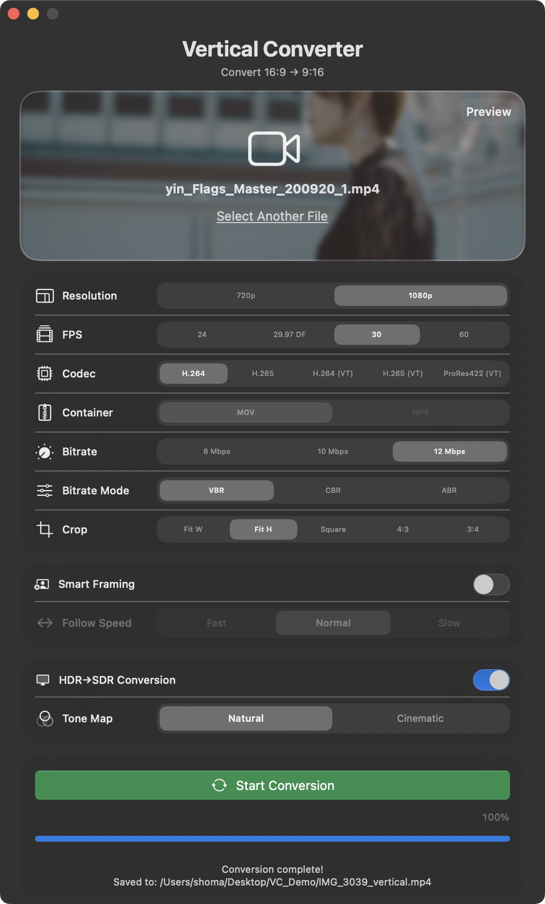
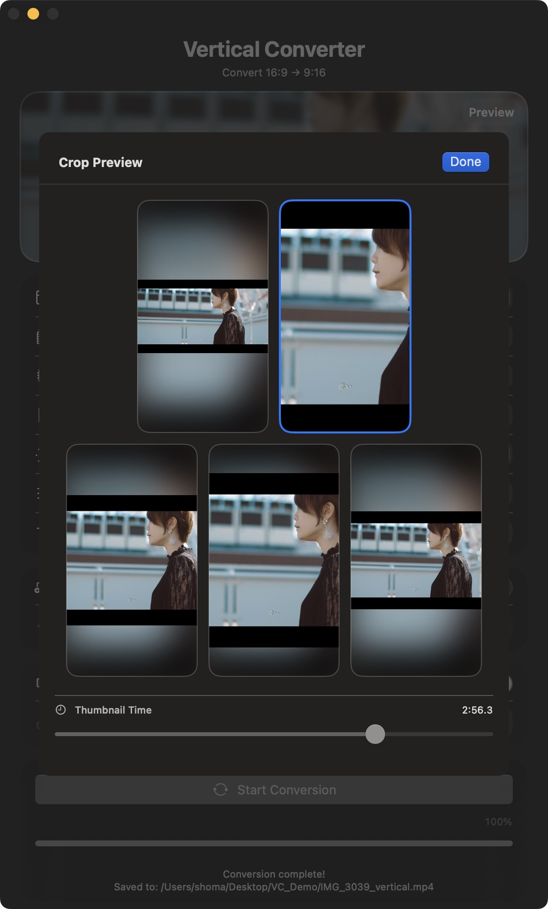

v<h1 align="center">Vertical Converter</h1>

<p align="center">
  <b>16:9 横長動画 → 9:16 縦型動画に変換する macOS ネイティブアプリ</b><br>
  YouTube ショート / Instagram リール / TikTok 向け
</p>

<p align="center">
  
  
  
  
</p>

<p align="center">
  
</p>

<p align="center">
  <a href="https://youtu.be/TacC07xiaG8">
    
  </a>
  &nbsp;
  <a href="https://ko-fi.com/ShmKnd">
    
  </a>
</p>

---

## スクリーンショット

<p align="center">
  &nbsp;&nbsp;
  
</p>

---

## 主な機能

### 🎬 変換 & クロップ

- **ドラッグ&ドロップ** — ファイルをウィンドウにドロップするだけ（複数ファイル対応）
- **バッチ変換** — 複数ファイルを一括選択し、順番に自動変換
- **5つのクロップモード** — Fit W / Fit H / Square / 4:3 / 3:4
- **クロッププレビュー** — サムネイル時刻シークつきでクロップ結果を事前確認

### 🧠 スマートフレーミング

- **Vision 人物追従** — 全フレームを解析し、被写体を自動追従しながら縦クロップ
- **IOU トラッキング** — 複数人物を個別追跡し、主役（長時間・安定）を自動推定
- **Y 方向ヘッドルーム** — ダンス・トーク動画でも頭の余白を自動確保
- **追従速度** — Fast / Normal / Slow の 3 段階から選択

### 🎨 HDR 対応

- **HDR → SDR 変換** — Natural / Cinematic トーンマッピング
- **HDR パススルー** — HLG/PQ/BT.2020 メタデータを保持したまま縦変換

### ⚙️ エンコード設定

| 設定 | 選択肢 |
|:--|:--|
| コーデック | H.264 / H.265 / H.264 (VT) / H.265 (VT) / ProRes422 (VT) |
| コンテナ | MOV / MP4（HEVC のみ選択可） |
| 解像度 | 720p (720×1280) / 1080p (1080×1920) |
| フレームレート | 24 / 29.97 DF / 30 / 60 fps |
| ビットレート | 8 / 10 / 12 Mbps |
| ビットレートモード | VBR / CBR / ABR |

### 🛡️ 入力の自動処理

- **hev1 → hvc1 自動リマックス**（再エンコードなし・品質劣化なし）
- **DNxHD/DNxHR 入力**を早期検知しエラーを返却
- **Dock プログレスバー**で変換進捗を表示

---

## 技術仕様

| 項目 | 内容 |
|:--|:--|
| 対応 OS | macOS 14.0 以降（Apple Silicon 専用） |
| 言語 | Swift / SwiftUI |
| フレームワーク | AVFoundation, Vision, Core Image, VideoToolbox |
| 処理方式 | 2パス（解析 → 変換）。スマートフレーミング OFF 時は 1パス |
| 出力形式 | MP4（H.264 + AAC 192kbps）/ MOV・MP4（H.265 + AAC）/ MOV（ProRes422） |
| 出力解像度 | 720×1280 または 1080×1920（9:16） |

---

## ビルド

```bash
cd VerticalConverter
open VerticalConverter.xcodeproj
# Xcode で ⌘+B (ビルド) または ⌘+R (実行)
```

---

## 使い方

1. 動画ファイルをウィンドウにドラッグ（複数可）、またはクリックして選択
2. 解像度・FPS・コーデック・ビットレート・クロップモードを設定
3. 必要に応じて **Preview** でクロップ結果を確認
4. 必要に応じて **スマートフレーミング** / **HDR→SDR 変換** を設定
5. **Start Conversion** をクリック
6. 完了後、Finder で保存先が自動表示

---

## プロジェクト構造

```
VerticalConverter/
├── VerticalConverterApp.swift              # エントリーポイント
├── ContentView.swift                       # メインUI + ContentViewModel（バッチ対応）
├── VideoProcessor.swift                    # 変換オーケストレーション（hev1 リマックス + 2パス）
├── VideoExportSettings.swift               # エクスポート設定
├── SmartFramingSettings.swift              # スマートフレーミング設定
├── SmartFramingAnalyzer.swift              # 第1パス: Vision解析 + IOUトラッキング
├── VerticalVideoCompositor.swift           # 第2パス: フレーム合成 + HDRトーンマッピング
├── CustomVideoCompositionInstruction.swift # AVVideoCompositionInstruction実装
└── DockProgress.swift                      # Dockプログレスバー
```

---

## アーキテクチャ

```
[前処理]
  hev1 → hvc1 リマックス ─┐
  DNxHD/DNxHR → エラー    │
  HDR メタデータ検出 ──────┘
                           ▼
[第1パス] SmartFramingAnalyzer（ON時のみ）
  人物検出 → IOUトラッキング → 主役推定 → 座標補間 → EMA → ホールド&フォロー
                           ▼
[第2パス] VerticalVideoCompositor
  precomputedOffsets で追従クロップ ／ OFF時はレターボックス＋ブラー背景
  HDR→SDR ON 時はトーンマッピング適用
                           ▼
[エンコード]
  H.264/H.265 (SW) → VTCompressionSession
  H.264/H.265 (VT) → AVAssetWriter (HW)
  ProRes422 (VT)    → AVAssetWriter (HW)
  オーディオ         → AAC 192kbps
```

---

<details>
<summary><h2>📖 スマートフレーミング詳細</h2></summary>

### ① fps 依存 EMA（指数移動平均）

```
α = 1 / (1 + fps × 0.2)
y[n] = α·x[n] + (1-α)·y[n-1]
```

| fps | α |
|:--|:--|
| 24 | ≈ 0.17 |
| 30 | ≈ 0.14 |
| 60 | ≈ 0.08 |

IIR フィルタ（EMA）による因果的スムージング。過去のみを参照し、直近フレームに重みを集中させ、古い情報は指数的に減衰。双方向ガウシアンは未来フレームを参照し「被写体が動く前にカメラが先読みでパンする」不自然な挙動を生むため、EMA で置換。パイプライン全体で一貫した指数減衰モデル。

### ② IOU トラッキング + 主役推定

```
検出 → PersonTracker（IOUマッチング）→ subjectScore 計算 → 加重中心
```

**PersonTracker**
- IOU ≥ 0.20 でグリーディマッチング
- 連続 5 検出間隔（≈40 フレーム）未検出で削除
- 各トラックに `lifespan`（累計検出回数）・`velocities`（直近 6 サンプル）を蓄積

**subjectScore（主役らしさ）**

$$\text{score} = \text{confidence} \times \underbrace{\max(0.2,\ 1 - |x{-}0.5| \times 1.6)}_{\text{centrality}} \times \underbrace{\min\!\left(1,\ \frac{\text{lifespan}}{fps \times 1.5}\right)}_{\text{lifespanWeight}} \times \underbrace{\frac{1}{1 + v \times 6}}_{\text{motionWeight}}$$

| ケース | 結果 |
|:--|:--|
| グループ 3 人（等価） | 全員が長寿命・低速度 → グループ中心を追う |
| 主役＋通過者 | 通過者は短命・高速 → 主役が支配的 |

### ③ 適応的検出間隔

```swift
let deviation = hypot(center.x - lastCenter.x, center.y - lastCenter.y)
detectionInterval = deviation > 0.10 ? 4 : 8
```

激しい動き（ダンス・スポーツ）では 4 フレーム毎に自動短縮。

### ④ Y 方向ヘッドルーム制御

| パラメータ | 値 | 説明 |
|:--|:--|:--|
| yZoomFactor | 1.1 | 10% ズームインで Y 方向パン余白を確保 |
| targetRatio | 0.80 | 下から 80% の位置に上半身を配置 |
| deadZoneRatio | 0.08 | 不感帯 |
| minHoldFrames | fps × 0.5s | Y 方向ホールド時間 |

### 安定化パイプライン

- **detectAllPositions** — サンプリング間隔で検出、サンプル間はホールド
- **補間** — 短いギャップは線形補間、長いギャップは fallback（中央）へ徐々に復帰
- **PersonTracker** — `maxMissed` 範囲内のトラック維持 + `weightedCenterAllowingMissed()` によるホールド中心
- **holdAndFollow** — 起動直後は即時スナップ、フォロー開始時は `warmupFrames = 15` でウォームアップ

</details>

<details>
<summary><h2>📖 HDR→SDR 変換詳細</h2></summary>

### トーンマッピングモード

| モード | macOS 15+ | macOS 14 フォールバック |
|:--|:--|:--|
| **Natural** | CIToneMapHeadroom | Reinhard extended + ハイライト彩度抑制 |
| **Cinematic** | CIToneMapHeadroom | ACES filmic カーブ |

### 処理フロー

1. 入力トラックから TransferFunction / ColorPrimaries / YCbCrMatrix を検出
2. `AVMutableVideoComposition` に色空間プロパティを設定（暗黙変換を防止）
3. ソースピクセルバッファを HLG/PQ カラースペースでタグ付け → CIContext が逆 OETF を適用
4. トーンマッピングで HDR 値を [0, 1] に圧縮
5. Rec.709 で SDR 出力にレンダリング

### HDR パススルー

- `CIContext` に `NSNull()` workingColorSpace で色管理を完全無効化
- HEVC エンコーダ入力は `32BGRA`（8bit 整数）で二重 OETF を回避
- H.264 / ProRes は `64RGBAHalf`（16bit float）で HDR 精度を最大化

### CIContext ウォームアップ

`renderContextChanged` で dummy バッファに対し `composeFrame` を 2 回実行し、Metal シェーダーコンパイル・テクスチャキャッシュを事前初期化。Frame 0 でのガンマ/色ずれを防止。

### AVMutableVideoComposition の色空間プロパティ

`colorPrimaries` / `colorTransferFunction` / `colorYCbCrMatrix` をソース HDR メタデータに合わせて設定。未設定の場合、AVFoundation が BT.709 を想定し暗黙の色空間変換を適用するため、彩度が変化する。

### HEVC HDR パススルーのピクセルフォーマット最適化

Apple の HEVC エンコーダは `64RGBAHalf` 入力を scene-linear と解釈し OETF を適用する。NSNull CIContext からの値は既に OETF エンコード済みのため、二重適用を回避するために `32BGRA`（整数）で出力。

</details>

<details>
<summary><h2>📖 実装メモ</h2></summary>

### エンコード

- H.264 / H.265（非 VT）→ `VTCompressionSession` によるソフトウェアエンコード
- H.264 (VT) / H.265 (VT) → `AVAssetWriter` によるハードウェアエンコード
- ProRes422 (VT) → `VTCopyVideoEncoderList` で HW エンコーダの有無を事前チェック
- HDR パススルー時は HEVC Main10 プロファイル
- HEVC SW エンコーダは B フレーム無効化（`AllowFrameReordering = false`）で QTX/Finder 互換を確保

### ドラッグ&ドロップ

- NSURL / URL / Data / String を順に扱うフォールバック処理で Finder ドロップ互換性を確保
- チェックマークは「変換完了」、ファイル選択直後は中立的なビデオアイコンを表示

### キャンセル処理

- `CancelToken` + `VTSessionRegistry` による安全なリソース解放
- `videoReadQueue`（直列キュー）で `copyNextSampleBuffer()` を直列化
- `safeResume` ガードで継続の二重 resume を防止
- `VerticalVideoCompositor` で保留中リクエストを追跡し `finishCancelledRequest()` を呼出

</details>

---

## 注意事項

- スマートフレーミング ON 時は第 1 パスで全フレームをスキャンするため変換時間が増加
- hev1 入力は変換前に hvc1 へリマックス（再エンコードなし）
- DNxHD/DNxHR は macOS 標準ではデコード不可（Avid コーデックパックが必要）
- App Sandbox は無効。ADP 未加入のため ad-hoc 署名で配布。初回起動時は右クリック →「開く」、または `xattr -cr VerticalConverter.app` で Gatekeeper を解除

---

## ロードマップ

- [x] カスタム出力解像度
- [x] フレームレート選択
- [x] プレビュー機能
- [x] スマートフレーミング（人物追従）
- [x] バッチ処理（複数ファイル一括変換）
- [x] HDR/HLG 対応（HDR→SDR 変換）
- [x] AVAssetWriter による厳密なビットレート制御
- [x] VTCompressionSession によるソフトウェアエンコード
- [ ] 透かし・テキスト追加機能
- [ ] 物体検出（人物以外のオブジェクト追従）
- [ ] 保存先・ファイル名の明示指定

---

## ライセンス

このプロジェクトは [MIT License + Commons Clause](LICENSE) の下で公開されています。詳細は LICENSE ファイルを参照してください。